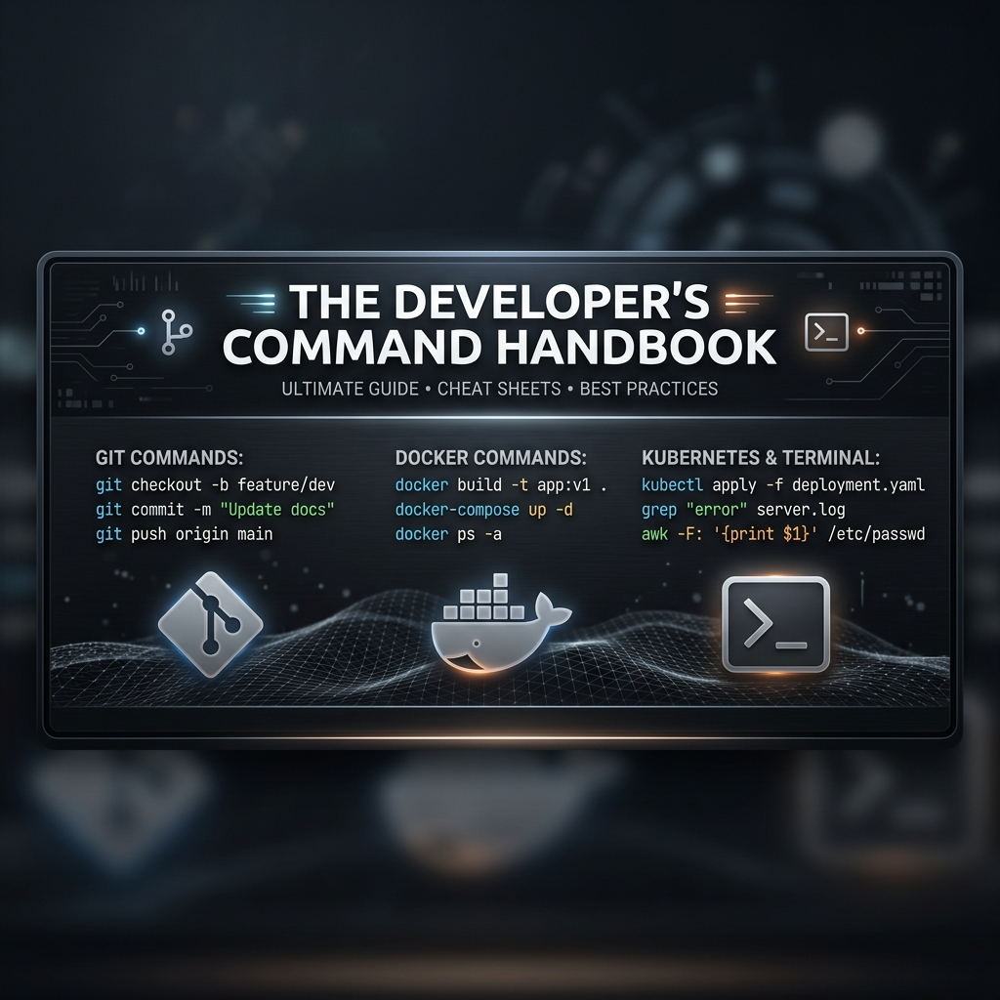

# Developer Command Handbook

<p align="center">
  
</p>

<p align="center">
  
  
  
  
</p>

---

## 🌟 Giới thiệu

**Developer Command Handbook** là một sổ tay cứu cánh (cheat sheet/handbook) tra cứu câu lệnh nhanh dành cho lập trình viên từ cơ bản đến nâng cao. Dự án tổng hợp đầy đủ các câu lệnh thông dụng thuộc nhiều mảng công nghệ khác nhau (Git, Docker, Laravel, React, Node.js, Linux, MySQL, Vite, v.v.), được thiết kế tối ưu, gọn gàng, giúp bạn tiết kiệm thời gian tra cứu hàng ngày.

Website được xây dựng dựa trên các tiêu chí: **Giao diện tối giản (Minimalist)**, **Trải nghiệm mượt mà**, **Hỗ trợ đa ngôn ngữ** và **Đầy đủ các biến thể tham số lệnh**.

---

## ✨ Tính năng nổi bật

### 📁 Sidebar phân loại nhóm danh mục gọn gàng
- Danh mục được nhóm trực quan thành 4 mảng chính: **Ngôn ngữ & Runtime**, **Frameworks**, **Công cụ & CSDL**, và **Hệ thống & Nền tảng**.
- Hỗ trợ **Thu gọn / Mở rộng (Collapse/Expand)** lưu trạng thái vào `localStorage`. Khi thu gọn, tiêu đề chữ sẽ tự động chuyển thành các đường kẻ ngăn cách tinh tế để duy trì thiết kế tối giản.

### ⚙️ Biến thể câu lệnh đa dạng (Command Variations)
- Không chỉ hiển thị một câu lệnh cơ bản, hệ thống cung cấp danh sách **các tham số bổ sung và biến thể thường dùng** (ví dụ: `git clone --depth 1`, `php artisan db:seed --class=...`).
- Mỗi biến thể đều đi kèm giải thích chi tiết bằng ngôn ngữ của bạn và ô code copy nhanh cực kỳ tiện lợi.

### 🌎 Hỗ trợ đa ngôn ngữ (Tiếng Việt, English, 日本語)
- Dịch nghĩa chuẩn xác và sửa đổi toàn bộ lỗi dấu tiếng Việt (diacritics) từ cơ sở dữ liệu gốc.
- Đã loại bỏ các cơ chế dịch tự động bằng Regex để tránh lỗi dịch sai từ kỹ thuật hoặc từ chuyên ngành.

### 🎨 Giao diện phẳng Minimalist thời thượng
- Tông màu tối giản (Trắng, Đen, Xám kẽm `zinc-gray`), hoàn toàn không sử dụng màu sắc rực rỡ hay gradient lòe loẹt.
- Ô code mô phỏng terminal macOS sang trọng với 3 nút chức năng, tích hợp hiệu ứng copy chuyển động mượt mà.
- **Trình lựa chọn Theme & Language** đầu tiên tự động kích hoạt cho khách truy cập mới, hỗ trợ xem trước trực tiếp (Live preview) thời gian thực và hiệu ứng chuyển cảnh mượt mà 250ms.

---

## 🛠️ Hướng dẫn cài đặt & Chạy dự án

### Yêu cầu hệ thống
- **Node.js** (Phiên bản v18 trở lên)
- **NPM** hoặc **Yarn**

### Các bước khởi chạy cục bộ

1. **Clone dự án về máy:**
   ```bash
   git clone https://github.com/maitrithanh/all-for-dev.git
   cd all-for-dev
   ```

2. **Cài đặt các thư viện phụ thuộc (Dependencies):**
   ```bash
   npm install
   ```

3. **Chạy server phát triển (Development Server):**
   ```bash
   npm run dev
   ```
   *Truy cập địa chỉ hiển thị trên terminal (thông thường là `http://localhost:5173`) để trải nghiệm.*

4. **Biên dịch sản phẩm (Production Build):**
   ```bash
   npm run build
   ```
   *Mã nguồn tối ưu tĩnh sẽ được xuất ra thư mục `/dist`.*

5. **Chạy thử bản Build sản phẩm (Preview Build):**
   ```bash
   npm run preview
   ```

---

## 📂 Cấu trúc thư mục dự án

```text
all_for_dev/
├── public/                # Ảnh tĩnh, favicon và logo illustration 3D
├── src/
│   ├── command/          # Component liên quan đến hiển thị mã lệnh (CodeBlock, v.v.)
│   ├── components/       # Các thành phần UI tái sử dụng (Badge, Button, Card...)
│   ├── data/             # Cơ sở dữ liệu JSON (commands.json, categories.json)
│   ├── hooks/            # Các custom hooks của ứng dụng (useTheme,...)
│   ├── i18n/             # Tệp quản lý đa ngôn ngữ & tệp từ điển dịch thuật
│   ├── layout/           # Bố cục cấu trúc (Header, CategorySidebar, RootLayout,...)
│   ├── lib/              # Tiện ích bổ sung, trình xử lý định dạng i18n
│   ├── pages/            # Các trang giao diện (Trang chủ, Chi tiết câu lệnh, Danh mục)
│   ├── types/            # Định nghĩa kiểu dữ liệu TypeScript (Command, Category,...)
│   ├── App.tsx           # Thành phần gốc định tuyến (Routing)
│   └── main.tsx          # Điểm khởi chạy của React
├── tailwind.config.js    # Cấu hình TailwindCSS
└── tsconfig.json         # Cấu hình TypeScript compiler
```

---

## 📝 Giấy phép

Dự án được phân phối dưới giấy phép **MIT License**. Bạn có thể thoải mái sử dụng, phát triển thêm hoặc đóng góp ý kiến.
